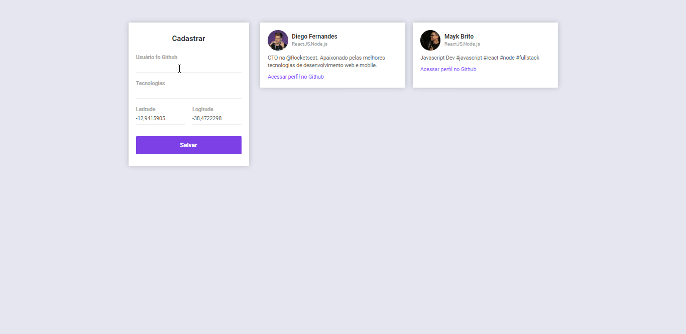

</img>
<h1 align="center">Semana Omnistack 10</h1>

 
                                                      
Esse projeto foi desenvolvido com as seguintes tecnologias:

- Node.js
- React
- React Native

## 🚀💻 Aplicação Web:

- Possível fazer o cadastro de devs em uma localização , onde conseguimos pegar a poisição do usuário pelo GPS do browser, retornando a lista de desenvolvedores cadastrados. 
- Uma aplicação REST que armazena os dados no MongoDB (Banco de dados não relacional)

## 🚀💻 How To Run

- Primeiro instale como dependências:
- yarn

## 🚀💻 Scripts de inicialização:

- Inicie a aplicação em modo desenvolvimento!
- yarn start

Breve atualização com aplicação Mobile. 

## :memo: Licença

Esse projeto está sob a licença MIT. Veja o arquivo [LICENSE](LICENSE.md) para mais detalhes.

---

Feito por  Wesley Guerra ♥ by Rocketseat 👋
